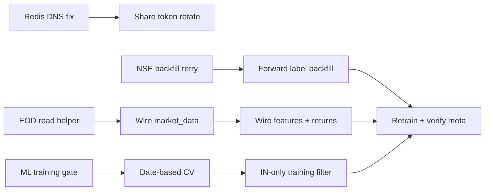

# Council V3 Action Plan

**Source:** [LLM_COUNCIL_RATING_V3.md](./LLM_COUNCIL_RATING_V3.md) top-5 recommendations  
**Goal:** Move from **7.2 A− (UX-strong, ML/ops-weak)** to **7.5+** with trustworthy training and stable ops  
**Horizon:** ~2 weeks at ~10 hrs/week (can compress to 1 week if full-time)

---

## Success metrics (definition of done)

| Metric | Today | Target |
|--------|------:|-------:|
| ML `positive_rate` in `model_meta.json` | 0.0% | ≥ 5% or model status `skipped` |
| IN bulk signals in DB | ~123 | ≥ 500 |
| API restart → `/health` | 502 (Redis DNS) | `status: ok` within 60s |
| Feature trend fetch | 100% yfinance live | ≥ 80% from `eod_prices` cache |
| Share token | weak/default token | random 32+ char, documented rotation |
| Labeled IN bulk 3mo forward returns | low | ≥ 30 (enables retrain) |

---

## Build order

Dependencies matter — do **Track A (ops)** and **Track B (ML gate)** first in parallel, then **Track C (EOD)**, then **Track D (backfill)**.



| Order | Track | Effort | Blocks |
|------:|-------|--------|--------|
| 1 | A — Ops stability | ~3 hrs | Everything else (502 kills API) |
| 2 | B — ML gate + CV | ~6 hrs | Bad model deploy |
| 3 | C — EOD cache | ~8 hrs | Scoring speed + offline reliability |
| 4 | D — NSE backfill + labels | ~6 hrs + wait | Meaningful retrain |
| 5 | A2 — Share token | ~30 min | Security before WAN |

---

## Track A — Fix Redis / Docker DNS (502 on restart)

**Problem:** `api` starts before Docker embedded DNS resolves `redis` → `ConnectionError: Error -3 connecting to redis:6379`.

### Tasks

1. **Add Redis to `api` startup retry** — `packages/core/queue.py`
   - Wrap `redis.from_url()` in lazy connect or retry loop (5×, 2s backoff)
   - Export `get_redis()` instead of module-level `redis_conn` that fails at import

2. **Harden `/health`** — `packages/api/main.py`
   - Lazy-init Redis on first ping; return `redis: "starting"` not crash
   - Optional: don't import `task_queue` at module load if Redis down

3. **Compose startup order** — `docker-compose.yml`
   - Add `api` `depends_on.redis.condition: service_healthy` (already present — verify healthcheck runs before api)
   - Add **`networks: default: driver: bridge`** explicit network (all services same network)
   - Remove external DNS override on **internal** services if it breaks Docker DNS — keep Google DNS only on `worker`/`processor` that call NSE, not on `api`/`redis`

4. **Document restart procedure** — one line in README:
   ```powershell
   docker compose up -d redis postgres && docker compose up -d api worker processor dashboard
   ```

### Acceptance

- `docker compose restart api` → within 60s `curl -u admin:pass http://192.168.1.42/api/health` returns `"status":"ok"`
- No import-time Redis crash in api logs

### Files

| File | Change |
|------|--------|
| `packages/core/queue.py` | Lazy Redis + retry |
| `packages/api/main.py` | Safe health check |
| `docker-compose.yml` | Network / DNS split (internal vs external) |
| `README.md` | Ordered restart note |

---

## Track B — ML training gate + date-based CV

**Problem:** `train.py` saves a model with `positive_rate: 0.0` and `test_accuracy: 1.0` (trivial classifier). Random split leaks future into past.

### Tasks

1. **Config knobs** — `packages/core/config.py` + `.env.example`
   ```env
   ML_MIN_POSITIVE_RATE=0.05
   ML_TRAIN_MARKETS=IN
   ML_TRAIN_SOURCES=nse_bulk,nse_block,bse_bulk
   WIN_THRESHOLD_PCT=0.0          # consider 3.0 after label review
   ```

2. **Filter training set** — `packages/processor/train.py` `_load_training_data()`
   - Only signals where `market in ML_TRAIN_MARKETS` and `source in ML_TRAIN_SOURCES`
   - Exclude `sec_13f`, `macro_theme` from bulk win-rate model (separate model later if needed)
   - Require `ForwardReturn.window == win_window` and non-null `return_pct`

3. **Date-based split** — replace `train_test_split(..., random_state=42)`
   - Sort by `signal.disclosed_at`
   - Train = oldest 80%, test = newest 20% (walk-forward holdout)
   - Store `train_cutoff_date` in `model_meta.json`

4. **Training gate** — before `pickle.dump`:
   ```python
   pos_rate = float(y.mean())
   if pos_rate < settings.ml_min_positive_rate:
     meta = {"status": "skipped", "reason": "positive_rate_too_low", "positive_rate": pos_rate, ...}
     # Do NOT overwrite good model — only write meta if no valid model exists
   ```
   - If gate fails: keep previous `lgbm_calibrated.pkl`, set `scorer_version` to `interim-v1` in scoring path

5. **Scoring fallback** — `packages/processor/scoring.py`
   - If `model_meta.status != "trained"`, always use rule-based + investor intel (already partial — enforce)

6. **System page label counts** — `GET /system/ml-status` or extend existing system endpoint
   - Return: `n_in_bulk`, `n_labeled_3mo`, `positive_rate`, `last_train_status`

7. **Tests** — `tests/test_train_gate.py`
   - Mock X,y all zeros → status `skipped`, no model file write
   - Mock 10% positive → status `trained`

### Acceptance

- `docker compose run --rm worker python scripts/train_only.py` with current DB → `status: skipped` (not `trained` with 0% pos)
- After ≥500 IN labels with some winners → `status: trained`, `positive_rate >= 0.05`
- `model_meta.json` includes `train_cutoff_date`, `train_markets`, `n_positive`, `n_negative`

### Files

| File | Change |
|------|--------|
| `packages/processor/train.py` | Filter, date split, gate |
| `packages/core/config.py` | New settings |
| `packages/processor/scoring.py` | Respect `skipped` meta |
| `packages/api/main.py` | ML status endpoint |
| `tests/test_train_gate.py` | New |
| `.env.example` | Document knobs |

---

## Track C — Wire `eod_prices` into features

**Problem:** `pull_free.py` stores ~3k EOD rows but `features.py` → `compute_trend_features()` still calls yfinance on every score.

### Tasks

1. **EOD read helper** — new `packages/processor/eod_cache.py`
   ```python
   def fetch_eod_history(db, ticker_normalized, market, days=180) -> list[dict]:
     # Query EodPrice WHERE ticker_normalized AND trade_date >= cutoff
     # ORDER BY trade_date ASC → [{date, close, volume}]
   def eod_coverage_ok(db, ticker, market, min_rows=60) -> bool: ...
   ```

2. **Layered fetch in `market_data.py`**
   - `fetch_price_history(ticker, days, db=None)`:
     1. In-memory TTL cache (keep existing)
     2. If `db` provided → `eod_cache.fetch_eod_history`
     3. Fallback → yfinance (log `source: yfinance_fallback`)
   - `compute_trend_features(ticker, db=None)` — pass db through

3. **Thread DB into call sites**
   - `features.build_features(db, signal)` → `compute_trend_features(signal.ticker_normalized, db=db)`
   - `returns.compute_forward_returns` — prefer EOD as-of disclosure date from DB, yfinance fallback
   - `api/main.py` batch price endpoints — optional `?source=cache`

4. **Daily EOD freshness job** — already in `pull_free` / scheduler; add:
   - After pull, log tickers with `< 60` rows (coverage gap report on System page)

5. **Metrics on System page** — show `eod_prices` count, `% tickers with 60+ rows`, last pull time (API already has snapshot endpoints — surface in UI)

### Acceptance

- Score 10 IN bulk signals → logs show `price_source: eod_cache` for tickers in DB
- Scoring works offline (disconnect worker from internet, EOD-backed tickers still score)
- Dashboard charts unchanged for covered tickers

### Files

| File | Change |
|------|--------|
| `packages/processor/eod_cache.py` | **New** |
| `packages/processor/market_data.py` | DB-first fetch |
| `packages/processor/features.py` | Pass db |
| `packages/processor/returns.py` | EOD for forward returns |
| `apps/dashboard/src/pages/SystemPage.tsx` | EOD coverage widget |

---

## Track D — NSE historical backfill → ≥500 IN bulk labels

**Problem:** Archive CSV yielded 123 rows; historical API returned 503; SEC 13F dominates training set.

### Tasks

1. **Retry script with backoff** — `scripts/backfill_nse.py`
   - Add `retry` subcommand: loop historical 90d with 30s sleep on 503, max 5 attempts
   - Log per-chunk status to stdout + `ingestion_runs`

2. **Archive expansion** — `packages/ingest/nse_client.py`
   - Verify archive CSV parser handles all column variants (already fixed once — add test fixture)
   - Run `backfill_nse.py 5000` when NSE CDN reachable

3. **Host-side fallback** (when Docker DNS fails NSE)
   - Document existing host ingest path in README (if script exists) or add `scripts/backfill_nse_host.ps1` that POSTs to `/internal/ingest/nse`

4. **Post-backfill pipeline** (single command)
   ```powershell
   docker compose run --rm worker python scripts/backfill_nse.py 5000
   docker compose run --rm worker python scripts/backfill_nse.py historical 180
   docker compose run --rm processor python -m processor.forward_backfill
   docker compose run --rm worker python scripts/train_only.py
   docker compose run --rm processor python -c "from processor.ml_jobs import rescore_all; print(rescore_all())"
   ```

5. **Label progress dashboard** — API + System page
   - `GET /system/label-stats`: `{in_bulk: N, labeled_3mo: M, maturity_pct: ...}`

6. **Scheduler hook** — `packages/ingest/scheduler.py`
   - Weekly Sunday: retry historical backfill if `in_bulk < 500`
   - Daily: `forward_backfill` for matured signals

### Acceptance

- `SELECT count(*) FROM signals WHERE source IN ('nse_bulk','nse_block') AND market='IN'` ≥ 500
- Forward returns labeled for matured subset ≥ 30
- Retrain either succeeds with `positive_rate >= 5%` or cleanly skips

### Files

| File | Change |
|------|--------|
| `scripts/backfill_nse.py` | Retry subcommand |
| `packages/ingest/nse.py` | Chunk backoff, dedupe stats |
| `packages/ingest/scheduler.py` | Weekly backfill retry |
| `packages/api/main.py` | `/system/label-stats` |
| `tests/test_nse_normalize.py` | Archive row fixtures |

---

## Track E — Rotate share token

**Problem:** A guessable share token gates the full ranked pick index + all signal detail via `/h/{token}` and `/s/{id}/{token}`.

### Tasks

1. **Generate token** (local, once):
   ```powershell
   python -c "import secrets; print(secrets.token_urlsafe(32))"
   ```

2. **Update `.env`** (not committed):
   ```env
   DASHBOARD_SHARE_TOKEN=<new-token>
   ```

3. **Update `.env.example`** — remove real default, use placeholder:
   ```env
   DASHBOARD_SHARE_TOKEN=change-me-generate-with-secrets-token-urlsafe-32
   ```

4. **Change config default** — `packages/core/config.py`
   - Default to `""` (disabled share) or require explicit set — forces conscious enable

5. **Restart + smoke**
   ```powershell
   docker compose restart api dashboard worker
   curl -u admin:pass "http://192.168.1.42/api/share/ranked-picks?limit=3" -H "X-Share-Token: <new>"
   ```
   - Old token → 401
   - New token → 200

6. **Re-send WhatsApp** with new links (daily picks / hold-profit scripts use `links.py` automatically after restart)

### Acceptance

- Old token rejected
- WhatsApp links use new token after one test send
- `.env.example` has no guessable default

### Files

| File | Change |
|------|--------|
| `.env.example` | Placeholder + rotation note |
| `packages/core/config.py` | Empty default |
| `docs/HTTPS_SETUP.md` | Token rotation paragraph |

---

## 2-week schedule (~10 hrs/week)

### Week 1 — Unblock ops + stop bad ML

| Day | Focus | Hours | Deliverable |
|-----|-------|------:|-------------|
| 1 | Track A | 3 | Redis lazy connect; no 502 on restart |
| 1 | Track E | 0.5 | New share token live |
| 2 | Track B (1–4) | 4 | Training gate + date split + IN filter |
| 3 | Track B (5–7) | 2 | Scoring fallback + tests + ml-status API |
| 4 | Track C (1–2) | 4 | `eod_cache.py` + market_data DB-first |
| 5 | Track D (1–2) | 2 | Backfill retry; run archive 5000 |

### Week 2 — Data depth + integration

| Day | Focus | Hours | Deliverable |
|-----|-------|------:|-------------|
| 6 | Track D (3–4) | 3 | Historical 180d + forward backfill |
| 7 | Track C (3–5) | 4 | features + returns wired; System EOD widget |
| 8 | Track D (5–6) | 2 | Label stats + scheduler hooks |
| 9 | Integration | 2 | Full pipeline run; verify metrics table |
| 10 | Council re-score | 1 | Update V3 doc or run V4 if targets hit |

**Buffer:** NSE 503 may require running backfill from host network or off-peak hours — not blocked on code.

---

## Verification checklist (run after Week 2)

```powershell
# 1. Health
curl -u admin:changeme http://192.168.1.42/api/health

# 2. Label stats
curl -u admin:changeme http://192.168.1.42/api/system/label-stats

# 3. ML meta
docker compose exec worker cat /app/models/model_meta.json

# 4. EOD coverage
curl -u admin:changeme http://192.168.1.42/api/system/snapshots/eod

# 5. Share token
curl -H "X-Share-Token: OLD" http://192.168.1.42/api/share/ranked-picks   # expect 401
curl -H "X-Share-Token: NEW" http://192.168.1.42/api/share/ranked-picks   # expect 200

# 6. Tests
docker compose run --rm worker pytest tests/test_train_gate.py tests/test_nse_normalize.py -q
```

---

## Explicitly deferred (not in this plan)

| Item | Why |
|------|-----|
| Paper trading / broker adapter | Cipher blocker; separate plan |
| ASM/GSM surveillance flags | Domain filter; after 500 labels |
| Prometheus metrics | Nice-to-have; health endpoint sufficient for now |
| SEC 13F separate model | After IN bulk model validates |
| Catch-up cron for missed WhatsApp | Ridge P2; separate from V3 top-5 |

---

## Risk register

| Risk | Mitigation |
|------|------------|
| NSE API stays 503 | Host-side backfill; expand archive CSV; manual CSV import endpoint |
| Still 0% positive rate after 500 deals | Raise `WIN_THRESHOLD_PCT` review; check forward return calc; bear market = fewer wins is OK — gate stays `skipped` |
| EOD gaps for small caps | yfinance fallback retained; log coverage % |
| Share token in old WhatsApp messages | One broadcast with new links; old token dies cleanly (401) |

---

*Plan derived from Council V3 unanimous priorities. Implement tracks A→B in parallel, then C→D, then re-run council when success metrics hit.*
